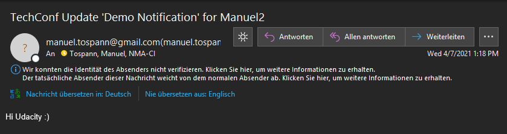

## Screenshots

The following screenshots should be taken and uploaded to this **screenshots** folder:

1. **Migrate Web Applications - 2 Screenshots**
 - Screenshot of Azure Resource showing the **App Service Plan**.
  - Screenshot of the deployed Web App running. The screenshot should be fullscreen showing the URL and application running.
  
  
  Live URL: https://app-toast-techconf.azurewebsites.net/
  
2. **Migrate Database - 2 Screenshots**
 - Screenshot of the Azure Resource showing the **Azure Database for PostgreSQL server**.
 
 - Screenshot of the Web App successfully loading the list of **attendees** and **notifications** from the deployed website.
 
3. **Migrate Background Process - 4 Screenshots**
 - Screenshot of the Azure Function App running in Azure, showing the **function name** and the **function app plan**.
 
 
 
 - Screenshots of the following showing functionality of the deployed site:
    
    For this step, I deleted the existing rows from the attendees table and registered two new attendees with my own e-mail addresses.
    
    
    1. Submitting a new notification.
      - Screenshot of filled out **Send Notification** form.
      
    2. Notification processed after executing the Azure function.
      - Screenshot of the **Email Notifications List** showing the notification status as **Notifications submitted**.
      
      - Screenshot of the **Email Notifications List** showing the notification status as **Notified X attendees**.
      
      
      
